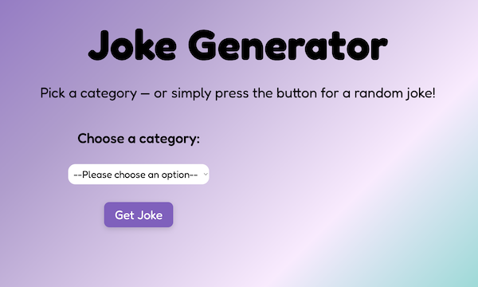

  

# Joke Generator

A simple joke generator built with HTML, CSS, and JavaScript.  
The user can pick a joke category or fetch a random joke using the JokeAPI.

## Features

- Choose from multiple joke categories
- Fetches jokes from an external API (JokeAPI)
- Displays single-line jokes and setup/delivery jokes
- Smooth animations and responsive design
- Deployed using GitHub Pages

## Technologies Used

- HTML
- CSS (Flexbox, Clamp, Animation)
- JavaScript (Fetch API)
- JokeAPI: https://v2.jokeapi.dev/

## Live Demo

👉 https://emmafredling.github.io/joke-generator/

## How It Works

1. User selects a category (or leaves it on "Any")
2. Clicks the **Get Joke** button
3. A request is sent to the API
4. The joke appears in the joke card with an animation
